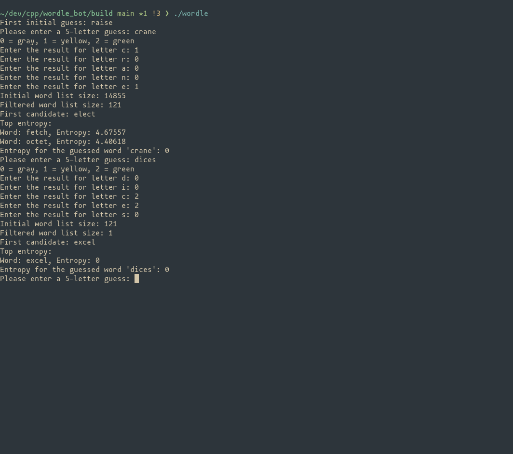

[](https://github.com/sub-arctic/wordle_bot/actions/workflows/ci.yml)
# Wordle Solver

## Overview
Wordle, like other games such as Mastermind, is simple at its core, but more complicated the further you explore. The premise is simple: deduce a random 5 letter word through valid guesses in 6 attempts. With each guess, more information is revealed about the answer; if a letter is green, it is correct and in the right position relative to the actual answer. Yellow means that the letter is present in the final answer, but not at that position, and gray means that the letter is not present in the final answer at all.

A simple, yet effective strategy for humans is to try to guess words that eliminate as many letters as possible, and to only use the ones that haven't been guessed as gray, and similar with green and yellow letters. The premise of this solver is fundamentally revolved around this concept, which primarily is based around Entropy. Entropy, or uncertainty (more information below).

This program will take the users guess (after suggesting one), and read in the feedback from the user as given by the game ("Y" for yellow, "G" for green and "N" for gray (or 1, 2, 0 respectively)). It will then "prune" the wordlist of valid wordle guesses using these criteria based on the rules highlighted above. Next, to determine the (subjectively) most optimal guess, it will calculate the entropy, or uncertainty for each remaining word, and output the two lowest. 

For the purpose of this explanation, the details about how entropy work aren't really necessary to understand it at a high level. The lower the entropy, the more certain the outcomes are. The higher the entropy, the more random the outcome is expected to be.

Calculating the entropy for wordle words is simple; it will take every word left in the wordlist, and "simulate" guessing it against every other word, analogous to playing a 1 turn game of wordle. The results from these simulations are saved per word, and then used in a function to calculate the entropy.

This implementation is by no means perfect. There are a multitude of other ways to optimise the outcomes, whether that be knowing what will actually be an answer, deeper searches or letter frequency analysis to weigh up against the entropy. More work will come to this project, including a more interactive and visual interface.

### Screenshots



### How Entropy Works

Entropy, in the context of this game, is a measure of uncertainty or unpredictability associated with the possible outcomes of a guess. The game calculates the entropy for each possible word based on the feedback received from previous guesses. A higher entropy value indicates that the word provides more information about the possible secret word, making it a better guess.

The feedback is represented as:
- **G** (Green): The letter is correct and in the correct position.
- **Y** (Yellow): The letter is correct but in the wrong position.
- **N** (Gray): The letter is incorrect.

The entropy is calculated using the formula:

$$ H(X) = -\sum p(x) \log_2(p(x)) $$

where p(x) is the probability of each feedback outcome.

For more information about entropy, here's a great place to start: [wikipedia.org](https://en.wikipedia.org/wiki/Entropy_(information_theory))

## Requirements

- CMake (version 3.10 or higher)
- A C++ compiler (e.g., g++, clang++)

## Building the Project

1. Clone the repository:

   ```bash
   git clone https://github.com/sub-arctic/wordle-entropy
   cd wordle-entropy
   mkdir build && cd build
   cmake ..

